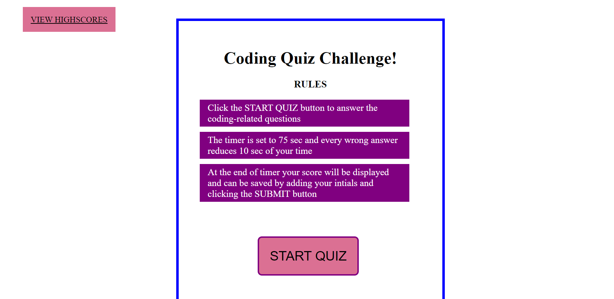
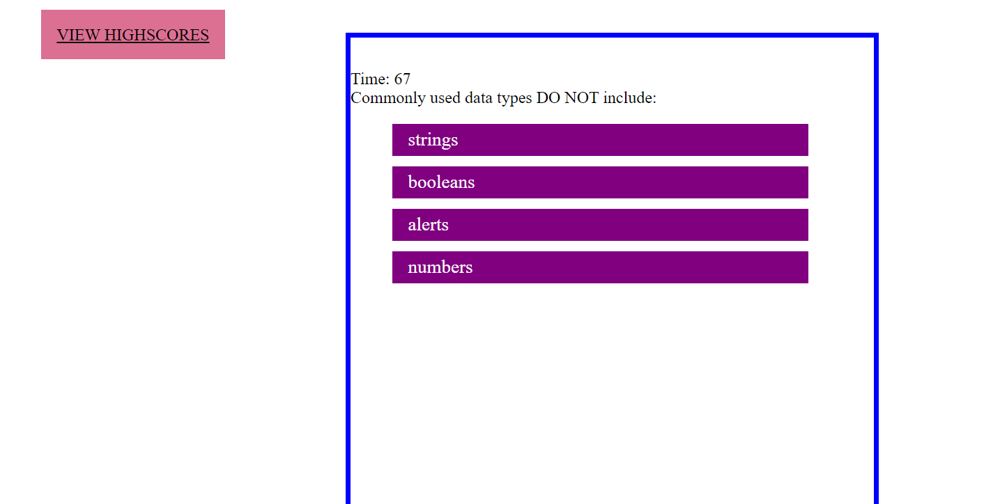
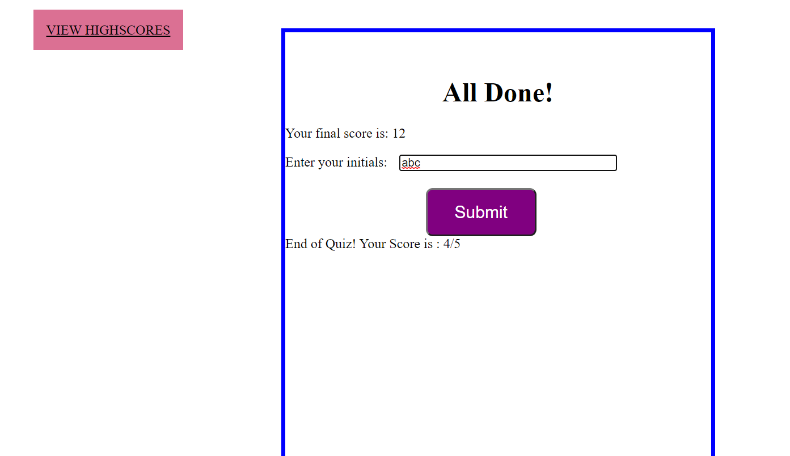
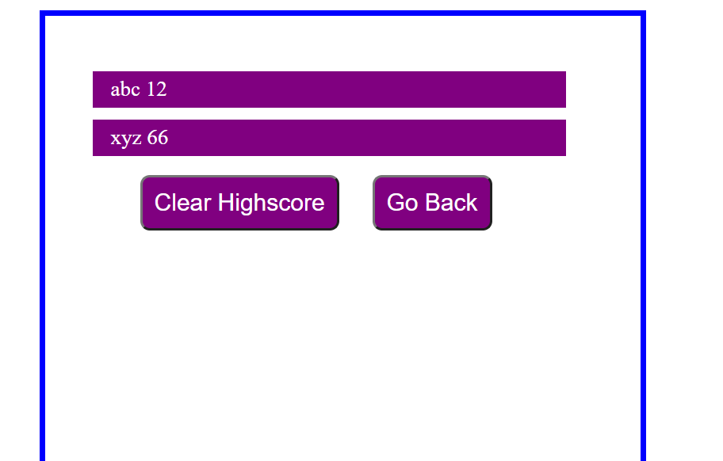

# CODE-QUIZ

## Introduction

- HTML and CSS and Javascript documents create a quiz with multiple choice questions with Javascript trivia
- This project emphasizes the use of using Javascript to make dynamic changes to an HMTL document
- This project utilizes the use of appending HTML pages

### This project has the following features:

- A Start Quiz button
  - This starts a timer for the user
  - Each question averages 15 seconds each for a total time of 75 seconds + 1.

- An appended HTML page that features questions, and multiple choice answers
  - If questions are answered incorrectly, 10 seconds are deducted off remaining time
  - Answers are recording using an event listener, "click" and tracks correct answers

- An appended HTML page that features:
  - Final score which is calculated using time remaining
  - A Summary of how many questions answered correctly
  - Input area to record initials
  - A Submit button
  - Submit buttom saves initials and score to local storage

- A Highscores HTML
  - This a list summary of intials and final scores
  - Clear button resets the page and local storage
  - Go back button travels to the start of the quiz

## Assets:

The following is the link to deployed code in github: https://github.com/SrilalithaN/Code-Quiz
The following is the link to deployed page of the application: https://srilalithan.github.io/Code-Quiz/

## Credits :

I have used the learning from class-activities by my instructors also youtube tutorials and google to help me with the project.
